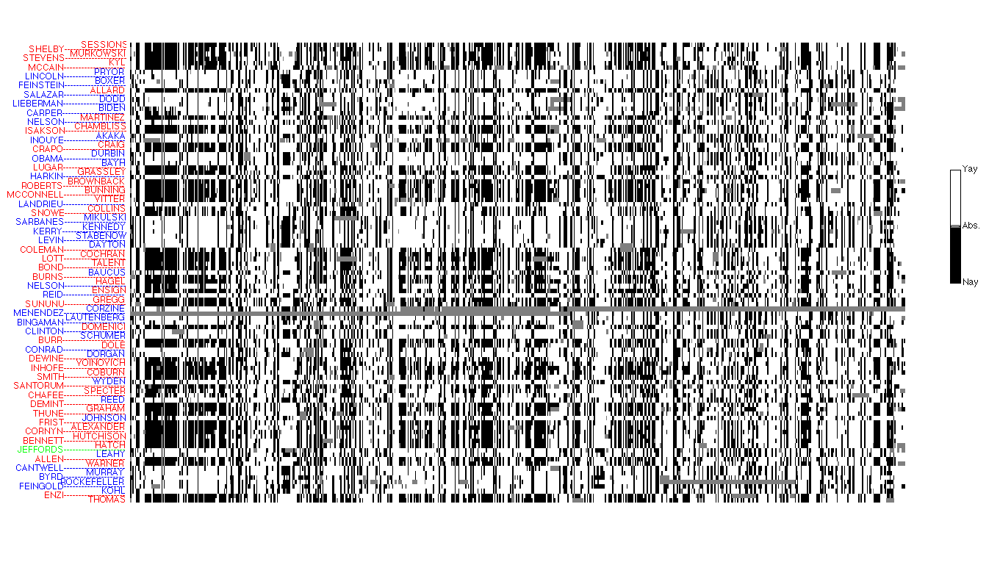
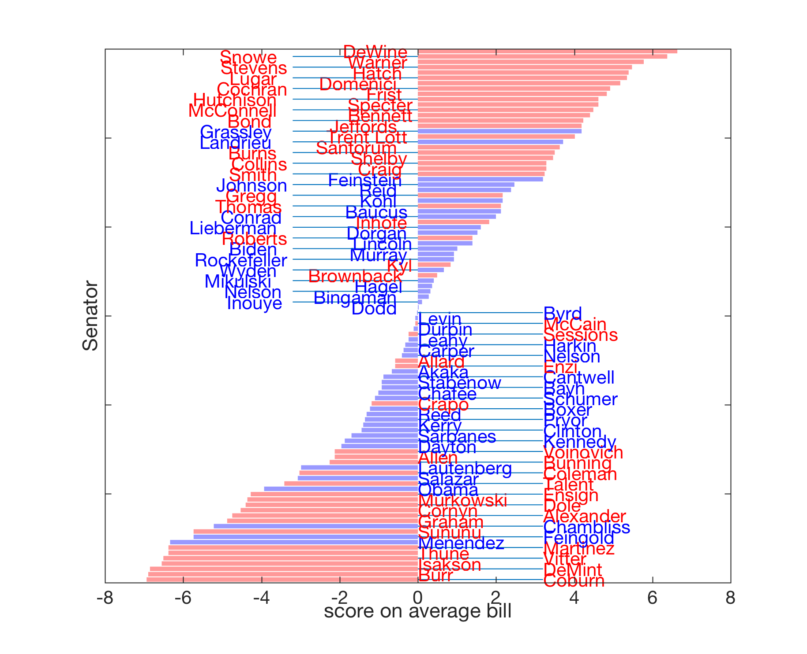
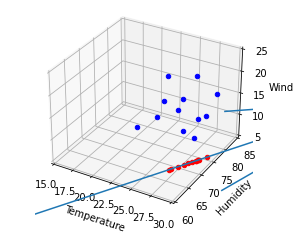

# Principal Component Analysis
A project regarding the concept of Principal Component Analysis (PCA), a method for reducing the dimension of massive data sets onto a projected vector  

Even if you aren't a mathmetician or data scientist, you've probably encountered some sort of visualized data set, one that was much too complicated to make much sense of. Yet, the idea of **Principal Component Analysis** is to condense those data points into a simple array of understandable information. An example can be used with **vector projections** which projects vectors of a certain dimension onto a 2D-space "direction" line vector. This line would include a projection, in the sense of assigning a "score" or "grade," to the data point, thus helping to better visualize the position of the data point in relation to the rest of the set. Vector Projection does not represent the value of the data point as much as it offers a relationship with other data points in the set.


# Senator Voting Data (Example)
Placing this into perspective, we can better understand how much a certain selection of points in a set are skewed towards one quality or the other, such as in a relation of sentator voting patterns. The image below represents a matrix of all the votes of US Senators in from the 2004-2006 term of 645 bills. Each row represents the votes of a single Senator, and each column represents the vote distribution of a single bill. The __Dark__ areas represent 'Nay' on a bill while the __Blank__ areas reprsent 'Yay' with __Gray__ representing an abstain.  

From the chart below, the data isn't very useful in determining the political biases of senators on a specific scale. Thus, we can use PCA projection to simplfy these data points into a more concise model.  



<p align="center">Fig 1 - Senator Data</p>

### Projection
By using an equation which takes the summation of all the votes of a specific senator, and calculating the **average**, we can assign a "score" to each, thus placing each senator in relation to one another and helping to determing political patterns. If each 'Nay' vote is given a value of -1 and each 'Yay' vote is given a value of 1 with each abstain given a value of 0, the average of these votes on each bill will represent the score of the senator. Comparing this example to vector projection, our "direction vector" is the score of the average bill in the set with a zero-mean score, meaning the vector of sample averages of the different data points. By plotting these scores on a single 2D visualized chart, we're presented with a projection of the Senator voting data, which can determine the bias of each senator attributed with their political affiliation.
| Nay | Yay | Abstain |
| --- | --- | --- |
| -1 | 1 | 0 |

<br>


<p align="center">Fig 2 - Projection along a mean-zero direction</p>


# Program
Using Python and the MatPlotLib library, I created a program that took vectors, calculated their projections, and plotted those projections on a predetermined line.  

Below is the weather data for 12 cities in Germany, with city[0] being the temperature, city[1] being the humidity, and city[2] being the wind speed for a particular day.
<br>
```python
Berlin = [26.133572, 80.328353, 5.015542];
Frankfurt = [23.161901, 76.886831, 14.021860];
Hamburg = [24.145767, 79.678764, 10.897413];
Nuremberg = [27.114319, 77.825100, 21.273423];
Munich = [24.573419, 74.416920, 21.734649];
Stuttgart = [20.615747, 81.827868, 6.316270];
Hanover = [26.513550, 80.462603, 9.568481];
Saarbruecken = [23.602173, 83.181582, 11.382041];
Cologne = [27.769321, 79.759665, 11.433353];
Constance = [29.343985, 78.814028, 17.818053];
Freiburg = [25.554123, 77.339895, 7.965502];
Karlsruhe = [19.780618, 76.517790, 6.304491];
```
<p align="center">Code Snippet 1 - City Weather Data</p>
<br>
I chose a random line vector that made sense in the context of the data:
<br>

```python
LineVector = [40, 120, 0];
```
By using the vector projection formula, by multiplying the direction vector with the data vector, dividing by the magnitude of the direction vector, and multiplying by the direction vector, I am able to calculate each city vector's projection onto the direction vector using the function:
<br>

```python
def projection(vector):
    projvector = [None, None, None];
    AV = ((vector[0] * LineVector[0]) + (vector[1] * LineVector[1]) + (vector[2] * LineVector[2]));
    temp = AV/v;
    projvector = ([LineVector[0] * temp, LineVector[1] * temp, LineVector[2] * temp]);
    return projvector;
```
<p align="center">Code Snippet 2 - Vector Projection Function</p>
<br>
From there, I plotted those points onto the direction vector in 3D space to achieve this visualization:
<br><br>

<p align="center">

    </p>
<p align="center">Fig 3 - Projection of data points onto the direction vector</p>
<br>

### Main Program: WeatherData.ipynb
